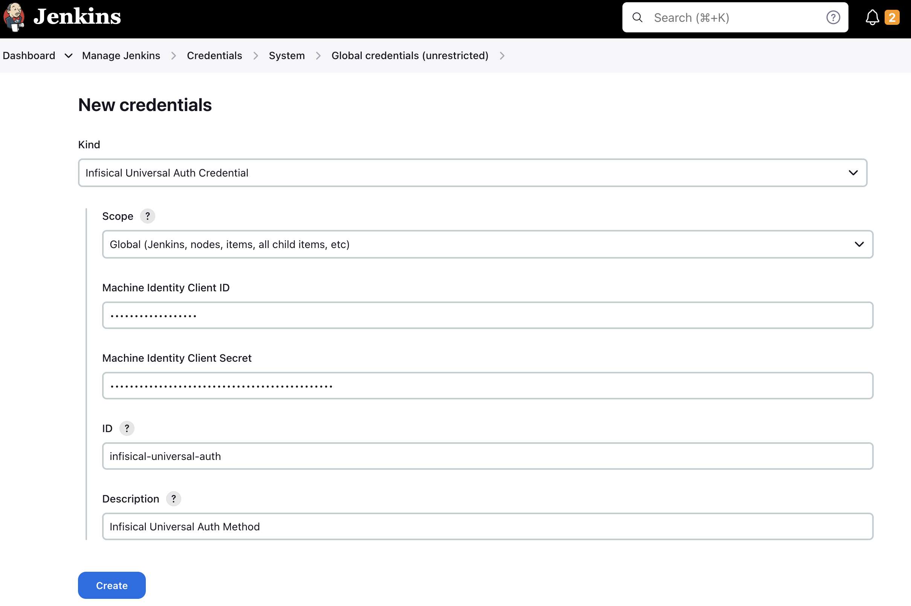
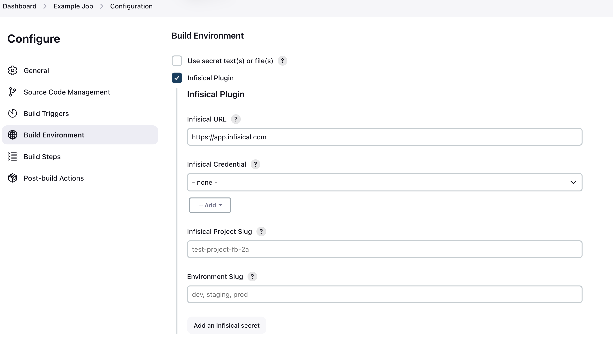
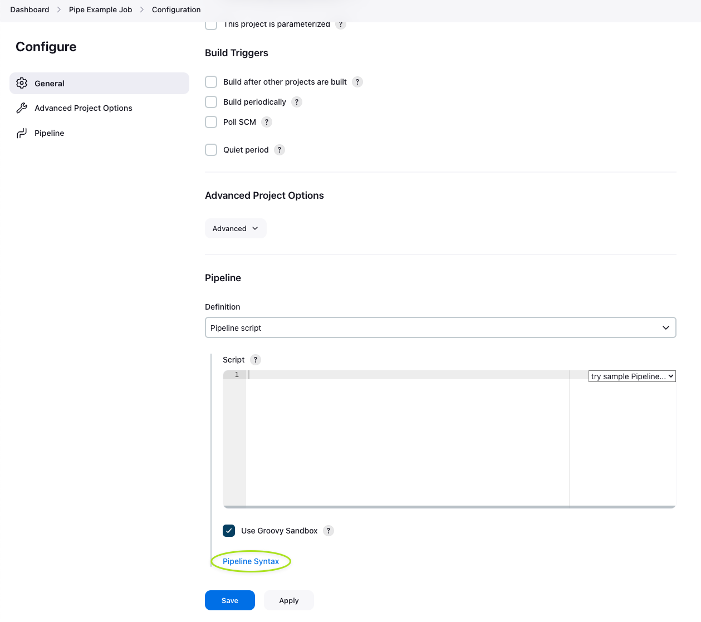
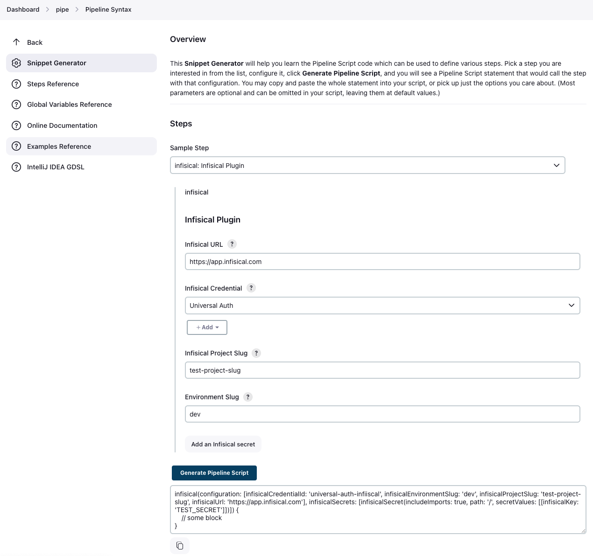

# Jenkins Infisical Plugin

This plugin adds a build wrapper to set environment variables from [Infisical](https://infisical.com), the open-source secrets manager. Secrets are generally masked in the build log, so you can't accidentally print them.

## Infisical Authentication

Authenticating with Infisical is done through the use of [Machine Identities](https://infisical.com/docs/documentation/platform/identities/machine-identities).
Currently the Jenkins plugin only supports [Universal Auth](https://infisical.com/docs/documentation/platform/identities/universal-auth) for authentication. More methods will be added soon.

### How does Universal Auth work?
To use Universal Auth, you'll need to create a new Credential _(Infisical Universal Auth Credential)_. The credential should contain your Universal Auth client ID, and your Universal Auth client secret.
Please [read more here](https://infisical.com/docs/documentation/platform/identities/universal-auth) on how to setup a Machine Identity to use universal auth.


### Creating a Universal Auth credential

Creating a universal auth credential inside Jenkins is very straight forward.

Simply navigate to `Dashboard -> Manage Jenkins -> Credentials -> System -> Global credentials (unrestricted)`.

Press the `Add Credentials` button and select `Infisical Universal Auth Credential` in the `Kind` field.

The `ID` and `Description` field doesn't matter much in this case, as they won't be read anywhere. The description field will be displayed as the credential name during the plugin configuration.




## Plugin Usage
### Configuration

Configuration takes place on a job-level basis.

Inside your job, you simply tick the `Infisical Plugin` checkbox under "Build Environment". After enabling the plugin, you'll see a new section appear where you'll have to configure the plugin.



You'll be prompted with 4 options to fill:
* Infisical URL
    * This defaults to https://app.infisical.com. This field is only relevant if you're running a managed or self-hosted instance. If you are using Infisical Cloud, leave this as-is, otherwise enter the URL of your Infisical instance.
* Infisical Credential
    * This is where you select your Infisical credential to use for authentication. In the step above [Creating a Universal Auth credential](#creating-a-universal-auth-credential), you can read on how to configure the credential. Simply select the credential you have created for this field.
* Infisical Project Slug
    * This is the slug of the project you wish to fetch secrets from. You can find this in your project settings on Infisical by clicking "Copy project slug".
* Environment Slug
    * This is the slug of the environment to fetch secrets from. In most cases it's either `dev`, `staging`, or `prod`. You can however create custom environments in Infisical. If you are using custom environments, you need to enter the slug of the custom environment you wish to fetch secrets from.
  
That's it! Now you're ready to select which secrets you want to fetch into Jenkins.
By clicking the `Add an Infisical secret` in the Jenkins UI like seen in the screenshot below.


You need to select which secrets that should be pulled into Jenkins.
You start by specifying a [folder path from Infisical](https://infisical.com/docs/documentation/platform/folder#comparing-folders). The root path is simply `/`. You also need to select wether or not you want to [include imports](https://infisical.com/docs/documentation/platform/secret-reference#secret-imports). Now you can add secrets the secret keys that you want to pull from Infisical into Jenkins. If you want to add multiple secrets, press the "Add key/value pair".

If you wish to pull secrets from multiple paths, you can press the "Add an Infisical secret" button at the bottom, and configure a new set of secrets to pull.


## Pipeline usage


### Generating pipeline block

Using the Infisical Plugin in a Jenkins pipeline is very straight forward. To generate a block to use the Infisical Plugin in a Pipeline, simply to go `{JENKINS_URL}/jenkins/job/{JOB_ID}/pipeline-syntax/`.

You can find a direct link on the Pipeline configuration page in the very bottom of the page, see image below.



On the Snippet Generator page, simply configure the Infisical Plugin like it's documented in the [Configuration documentation](#configuration) step.

Once you have filled out the configuration, press `Generate Pipeline Script`, and it will generate a block you can use in your pipeline.



### Using Infisical in a Pipeline

Using the generated block in a pipeline is very straight forward. There's a few approaches on how to implement the block in a Pipeline script.
Here's an example of using the generated block in a pipeline script. Make sure to replace the placeholder values with your own values.

The script is formatted for clarity. All these fields will be pre-filled for you if you use the `Snippet Generator` like described in the [step above](#generating-pipeline-block).
```groovy
node {
    infisical(
        configuration: [
            infisicalCredentialId: 'YOUR_CREDENTIAL_ID',
            infisicalEnvironmentSlug: 'PROJECT_ENV_SLUG', 
            infisicalProjectSlug: 'PROJECT_SLUG', 
            infisicalUrl: 'https://app.infisical.com' // Change this to your Infisical instance URL if you aren't using Infisical Cloud.
        ], 
        infisicalSecrets: [
            infisicalSecret(
                includeImports: true, 
                path: '/', 
                secretValues: [
                    [infisicalKey: 'DATABASE_URL'],
                    [infisicalKey: "API_URL"],
                    [infisicalKey: 'THIS_KEY_MIGHT_NOT_EXIST', isRequired: false],
                ]
            )
        ]
    ) {
        // Code runs here
        sh "printenv"
    }     
}
```

